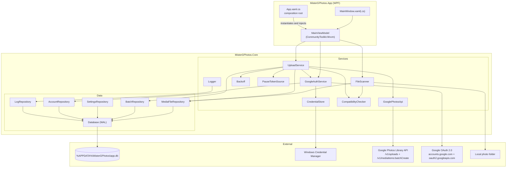
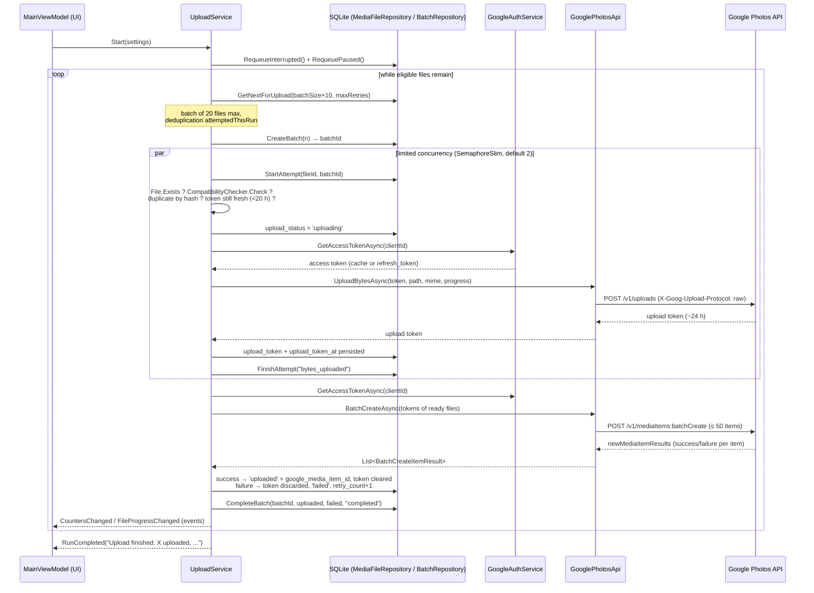

# Architecture — Google Photos Local Uploader

> Technical document for developers. It describes the actual architecture of the code
> present in this repository; every behavior described here has been verified against the sources.

## 1. Overview

Google Photos Local Uploader is a Windows 10/11 desktop application (WPF, .NET 8, C#)
that:

1. **scans** a local image folder recursively,
2. **indexes** each file in a local SQLite database (path, size, dates, SHA-256 hash),
3. **uploads** files in batches to Google Photos via the official HTTP API
   (Library API), with **resume after interruption**: every state transition is
   persisted to the database, so that a shutdown, a crash or a network outage never
   loses the work already done.

Non-negotiable principles, enforced in the code:

- The application **never deletes** a local file or a Google Photos media item.
- Secrets (OAuth refresh token, client secret) are stored in the
  **Windows Credential Manager** (`advapi32` / `CredWriteW`), never in cleartext on disk.
- No API capability is assumed beyond what Google documents: since the
  **March 31, 2025** changes, the Google Photos Library API only allows reading back
  media created by the application itself. The interface therefore states plainly:
  "Google Photos does not allow this application to check your entire library.
  Duplicate detection is guaranteed only for files already indexed locally or uploaded
  by this application."
  This disclaimer text now lives in the localization resources (`Strings.resx` /
  `Strings.fr.resx`, key `"Disclaimer_Duplicates"`).

## 2. Stack choice: WPF + .NET 8

The requirement is a **Windows-only** application, durable, with native access to
Windows APIs (Credential Manager via P/Invoke `advapi32`), intensive file processing
(SHA-256 hashing, HTTP streaming of large files) and a rich but classic interface
(tabs, tables, progress bars).

| Criterion | **WPF / .NET 8 (chosen)** | .NET MAUI | Avalonia | Electron |
|---|---|---|---|---|
| Target | Windows desktop, mature since 2006 | Mobile-first; Windows desktop goes through WinUI 3, still-young ecosystem | Cross-platform, but adds an abstraction layer that is useless for Windows-only | Cross-platform via Chromium |
| Native Windows access (Credential Manager, `HttpListener` loopback) | Direct (trivial P/Invoke, same runtime) | Possible but through per-platform abstractions | Possible but outside the framework core | Requires native Node modules or bridges |
| Footprint | Reasonable self-contained executable, a single .NET process | Comparable, but with Windows App SDK dependencies | Comparable | A full Chromium embedded (~200 MB, several processes, high RAM) |
| I/O + hash + background upload performance | Excellent: `Task`, `async/await`, native .NET streams | Equivalent (same runtime) but no benefit here | Equivalent | JavaScript/Node: fine but less suited to controlled binary streaming |
| Tooling / tests | `dotnet build`, `dotnet test`, xUnit, proven MVVM (CommunityToolkit.Mvvm) | Still stabilizing | Good but smaller ecosystem | Web ecosystem, but heavier desktop tests |
| Longevity | Supported component of .NET 8 (LTS) | High rate of change | Dynamic open-source project but external to Microsoft | Depends on the Chromium cadence |

Conclusion: for an **exclusively Windows** application, with no web or mobile need,
WPF on .NET 8 is the simplest, most stable and most performant choice.
MAUI and Avalonia would pay a cross-platform abstraction cost with no benefit;
Electron would additionally pay a memory/size cost that is unjustifiable for a file uploader.

Another structuring choice: **no Google SDK**. The official PhotosLibrary .NET client
is deprecated; the application therefore speaks **HTTP directly** (only two endpoints,
see §6), which removes a dead dependency and makes the network behavior
fully auditable in `GooglePhotosApi.cs`.

## 3. Solution breakdown

```
MisterGPhotos.sln
├── src/MisterGPhotos.Core/     Pure business logic (no WPF dependency)
│   ├── Models/                   Enums, MediaFile, AppSettings, GoogleAccount, UploadBatch
│   ├── Data/                     Database, Migrations, *Repository (SQLite)
│   ├── Resources/                Strings.resx (English), Strings.fr.resx (French), Loc helper
│   └── Services/                 Scan, auth, API, upload, logging…
├── src/MisterGPhotos.App/      WPF presentation layer (MVVM)
│   ├── App.xaml(.cs)             Composition root (service instantiation)
│   ├── MainWindow.xaml(.cs)      Main window + clean shutdown
│   ├── Localization/LocExtension XAML markup extension {l:Loc Key}
│   ├── Views/OAuthWizardWindow   Google Cloud wizard (6 steps, console links, JSON import)
│   └── ViewModels/               MainViewModel, OAuthWizardViewModel
├── src/MisterGPhotos.Tests/    xUnit: CoreLogic, Database, FileScanner, OAuthClientConfig (59 tests)
├── build/build.ps1, build/publish.ps1
├── scripts/setup-google-cloud.ps1  (Optional) gcloud: project + API enablement (the "Desktop app"
│                                   OAuth client cannot be automated by any API)
└── installer/setup.iss           Inno Setup installer
```

- **`MisterGPhotos.Core`** references neither WPF nor anything UI-related: it is
  testable from a console and by xUnit. Everything touching SQLite, the network, OAuth
  and the upload state machine lives here.
- **`MisterGPhotos.App`** contains no business logic: `App.xaml.cs` is the
  *composition root* (it builds `Database`, the repositories, `HttpClient`,
  `GoogleAuthService`, `GooglePhotosApi`, `FileScanner`, `UploadService`, then injects
  everything into `MainViewModel`). Injection is manual, with no DI container: the object
  graph is small and entirely visible in `OnStartup`.
- **`MisterGPhotos.Tests`** covers the Core logic (backoff, compatibility, pause,
  migrations, repositories, scanner) — 59 tests, all green.

### Internationalization (i18n)

The application is internationalized. All user-facing strings come from resource files
rather than being hard-coded:

- **Resource files** live at `src/MisterGPhotos.Core/Resources/Strings.resx`
  (English, the default/fallback culture) and `Strings.fr.resx` (French). Each
  additional `Strings.<culture>.resx` compiles into a satellite assembly.
- **`MisterGPhotos.Core.Resources.Loc`** is a static helper (`T`/`TF`) backed by a
  `ResourceManager`. `T` returns a localized string by key; `TF` formats it with arguments.
- **`MisterGPhotos.App.Localization.LocExtension`** is a WPF markup extension used in
  XAML as `{l:Loc Key}` to bind a control to a resource key.
- The **UI culture is taken from the OS at startup**: `App.OnStartup` sets
  `Loc.Culture = CultureInfo.CurrentUICulture` and
  `CultureInfo.DefaultThreadCurrentUICulture`.
- **Adding a language** only requires adding a `Strings.<culture>.resx` file (which
  produces a satellite assembly); no code change is needed.

## 4. Responsibility of each service (`src/MisterGPhotos.Core/Services/`)

| File | Responsibility |
|---|---|
| `AppPaths.cs` | Local data locations: `%APPDATA%\MisterGPhotos\` (`app.db`, `logs\app-YYYYMMDD.log`). |
| `Logger.cs` | Triple logging: a daily text file, the SQLite table `app_logs` (excluding the Debug level), and the `MessageLogged` event for real-time display in the UI. Must never receive sensitive data (token, secret). A log write failure never brings the application down. |
| `CredentialStore.cs` | Read/write/delete of secrets in the Windows Credential Manager via P/Invoke `advapi32` (`CredWriteW`, `CredReadW`, `CredDeleteW`). Exact targets: `MisterGPhotos/RefreshToken` and `MisterGPhotos/OAuthClientSecret`. |
| `CompatibilityChecker.cs` | Checks that a file is acceptable: extension present in `AppSettings.IncludedExtensions` (configurable list, default: jpg, jpeg, png, webp, heic, heif, gif, tif, tiff, bmp, avif, ico + RAW dng, cr2, cr3, crw, nef, nrw, arw, orf, raf, rw2, srw, pef, srf, sr2), non-empty, size ≤ 200 MB (Google Photos photo limit). Also provides the MIME type sent to the upload endpoint (`MimeTypeFor`). |
| `FileScanner.cs` | Recursive scan of the root folder (`EnumerationOptions`: subfolders, ignores inaccessible items, skips reparse points and system files). For each image: if size + modification date are unchanged and the hash is already known → simple update of `last_seen_at` (no re-hash); otherwise SHA-256 computation, duplicate detection by hash (already uploaded → `skipped_duplicate_remote_app_created`; local duplicate → `skipped_duplicate_local`), transition to `queued`. Modified content resets the file (status, token, attempt counter). Never downgrades an `uploaded` file. At the end of the scan, files under the root that were not seen again move to `scan_status = 'missing'`. |
| `PauseTokenSource.cs` | Cooperative pause token: the orchestrator calls `WaitWhilePausedAsync` between each step and freezes while the pause is active; `Resume` releases all waits. |
| `GoogleAuthService.cs` | OAuth 2.0 **Authorization Code + PKCE** for an installed application: opens the default browser, `HttpListener` on `http://127.0.0.1:{port}/` (a free port chosen dynamically), verifies the `state`, exchanges the code, 5-minute timeout. Exact scopes: `photoslibrary.appendonly`, `photoslibrary.readonly.appcreateddata`, `openid`, `email`. Caches the access token in memory (expiration minus a 60 s margin), refreshes it under a lock (`SemaphoreSlim`) to avoid concurrent refreshes, throws `AuthRequiredException` if the refresh token is rejected (400/401) — a sign that the Google session has expired or been revoked. `SignOutAsync` revokes the token on a best-effort basis (tolerates being offline) then clears the local secrets. |
| `GooglePhotosApi.cs` | Minimal HTTP client for the Library API, **only two endpoints**: `POST https://photoslibrary.googleapis.com/v1/uploads` (raw bytes, headers `X-Goog-Upload-Protocol: raw` and `X-Goog-Upload-Content-Type`, streaming with progress via `ProgressReadStream`) → upload token; `POST https://photoslibrary.googleapis.com/v1/mediaItems:batchCreate` (max 50 items, `AppSettings.MaxBatchSize`). Classifies each HTTP error as transient/permanent and extracts `Retry-After` (see §8). |
| `Backoff.cs` | Exponential backoff: 1 s base, doubling per attempt, **60 s cap**, random jitter 0–500 ms; a `Retry-After` provided by Google is honored first (capped at the ceiling). |
| `UploadService.cs` | Upload orchestrator (detailed in §6 and §7): consumes the `queued` queue in batches (default 20 files), obtains upload tokens with limited concurrency (`SemaphoreSlim`, 1–3, default 2), calls `batchCreate`, persists **every** state transition to SQLite, handles pause/resume/stop, throughput over a 30 s sliding window, and estimation of the remaining time. |

On the data side (`src/MisterGPhotos.Core/Data/`): `Database.cs` opens SQLite in
**WAL** mode with `busy_timeout=5000` and `foreign_keys=ON` (resilience to abrupt
shutdowns and to concurrent scan + upload + UI access); `Migrations.cs` applies
versioned scripts within a transaction (table `schema_version`); the repositories
(`MediaFileRepository`, `SettingsRepository`, `AccountRepository`, `BatchRepository`,
`LogRepository`) are the only SQL access points, all parameterized.

## 5. Component diagram



## 6. Upload sequence

The flow for a batch (default: 20 files, 2 concurrent byte uploads):

1. **Phase 1 — bytes**: for each file, `POST /v1/uploads` with the raw bytes
   → **upload token** (valid ~24 h on Google's side; the application considers it fresh
   for **20 h**, constant `UploadTokenLifetime`).
2. **Phase 2 — creation**: a single `POST /v1/mediaItems:batchCreate` with all the
   batch's tokens (hard limit: 50 items per call).



Before each byte upload, `PrepareUploadTokenAsync` re-checks, in order:
the file's existence on disk, compatibility with the **current** settings,
duplication against an already-uploaded file (by hash), and the presence of an upload
token that is still fresh — in which case the bytes are **not resent** (attempt result
`token_reused` in `upload_attempts`).

## 7. Resume-after-interruption strategy

The general rule: **SQLite is the source of truth**. Each file carries an
`upload_status` (`discovered`, `queued`, `uploading`, `uploaded`,
`skipped_duplicate_local`, `skipped_duplicate_remote_app_created`,
`skipped_incompatible`, `failed`, `paused`) and a `scan_status` (`scanned`, `missing`),
updated at each step. The database is in WAL mode, hence consistent even after an
abrupt shutdown.

| Case | Behavior verified in the code |
|---|---|
| **Window closing** | `MainWindow.OnClosing` cancels the close, calls `MainViewModel.ShutdownAsync()` (scan cancellation, `UploadService.StopAsync()`), then closes for real. Cancellation moves `uploading` files to **`paused`** (`MarkUploadingAsPaused`). On the next upload launch, `RequeuePaused()` puts them back in `queued`. |
| **Crash / power loss** | No code runs, but the already-persisted statuses survive (WAL). On the next startup, `App.OnStartup` calls `UploadService.RecoverAfterRestart()`: any file left `uploading` becomes `queued` again (`RequeueInterrupted`). If an upload token had been obtained and persisted before the crash (crash **between** the byte upload and the `batchCreate`), it is **reused as-is** if it is less than 20 h old: the bytes are not resent. |
| **Network loss** | `HttpRequestException` errors and 5xx/429 are retried within the same attempt (up to 3 internal retries, `InAttemptTransientRetries`, with backoff). Beyond that, the file moves to `failed` with `retry_count + 1` — it will be resumed as long as `retry_count < MaxRetries` (default 5). After **5 consecutive transient failures** across all files (`ConsecutiveTransientLimit`), the circuit breaker stops the whole run (see §8); `uploading` files move back to `paused`. |
| **Access token expired (401 mid-upload)** | `InvalidateAccessToken()` then a new attempt: `GetAccessTokenAsync` refreshes via the refresh token (under a lock to avoid double refreshes). Transparent to the user. |
| **Refresh token expired or revoked** | The refresh returns 400/401 → `AuthRequiredException`. The run stops cleanly: `uploading` files → `paused`, event `AuthenticationLost` → the UI shows "Google session expired: reconnect your account then relaunch the upload." Nothing is lost; after reconnecting, the upload resumes where it left off. |
| **File gone (moved/deleted since the scan)** | Checked just before the upload: `File.Exists` fails → `scan_status = 'missing'`, status `failed` with the message "File not found (moved or deleted since the scan).", marked **permanent** (`retry_count` is raised to `MaxRetries` so it is not retried in a loop). The scan also marks as `missing` the files not seen again under the root (except those already `uploaded`). |
| **Failure of the whole `batchCreate` (permanent error)** | The batch's files move back to `queued` and their upload tokens **stay in the database**: on the next pass, if they are still fresh, only the `batchCreate` calls are replayed, without resending the bytes. |
| **Failure of an individual `batchCreate` item** | The token is considered consumed or refused: it is **discarded** (`upload_token = NULL`) and the file moves to `failed` (transient) — the bytes will be resent on the next attempt. |
| **User pause** | `PauseTokenSource`: the file in progress **finishes** (the wait is only checked between steps), then the pipeline freezes without losing anything. `Resume` restarts instantly. |
| **Exhausted failed file** | A `failed` file with `retry_count ≥ MaxRetries` is no longer selected. The UI's "requeue" button calls `MediaFileRepository.ResetFailed()` (retry_count reset to 0, status `queued`, error cleared). |

Anti-loop guarantee within a single run: `RunAsync` keeps a `HashSet`
`attemptedThisRun` — a file is only attempted once per run, even if it falls back to a
retriable `failed`.

## 8. Error handling

### Transient / permanent classification

`GooglePhotosApi.ClassifyError` produces a `GooglePhotosApiException` carrying
`StatusCode`, `IsTransient` and `RetryAfter`:

| HTTP status | Classification | Handling |
|---|---|---|
| **429** | Transient | Retry with backoff; message "Google Photos request limit reached (429). Automatic retry." |
| **≥ 500** | Transient | Retry with backoff. |
| **403** containing `quota` or `rate` in the Google error message | Transient | Retry with backoff (quota/rate limit). |
| **403** (other) | Permanent | File to `failed`, `retry_count` raised to the maximum (no automatic retry). |
| **401** | Special case | Neither transient nor permanent: invalidate the cached token + refresh, then a new attempt. If the refresh itself fails → `AuthRequiredException` (reconnection required). |
| **408 / 425** | Transient | Retry with backoff (timeouts replayable by definition, RFC 9110). |
| `HttpClient` timeout (`TaskCanceledException` without user cancellation) | Transient | Reclassified as a transient `GooglePhotosApiException`: backoff/retry, without being confused with a deliberate stop. |
| Other 4xx | Permanent | `failed`, not retried automatically. |
| `HttpRequestException` (network) | Transient | Internal retries, then `failed` with `retry_count + 1`; counts toward the network circuit breaker. |
| `IOException` / `UnauthorizedAccessException` (local error: locked file, cloud placeholder...) | Transient | `failed` with `retry_count + 1`, but **does not count** toward the network circuit breaker. |

Two retry levels combine:

1. **Within the attempt**: up to 3 internal retries (`InAttemptTransientRetries`)
   with backoff, to absorb short hiccups without touching the file's status.
2. **Between runs**: a transient `failed` file is resumed as long as
   `retry_count < MaxRetries` (default 5, configurable 0–20).

### Backoff

`Backoff.For(attempt, retryAfterHint)`:

- if Google provides a `Retry-After` header (duration or date), it is **honored
  first**, capped at 60 s;
- otherwise: `1 s × 2^attempt`, capped at **60 s**, plus a random **jitter** of
  0–500 ms to desynchronize clients.

### Circuit breaker

`UploadService` counts **consecutive network failures** across all files
(`_consecutiveTransient`, reset to zero on each success; local errors such as a locked
file do not participate). On the 5th (`ConsecutiveTransientLimit`),
`RegisterTransientFailure` throws:
"Too many consecutive network errors. Check the Internet connection then relaunch the
upload." The whole run stops cleanly (`uploading` files → `paused`) rather than marking
hundreds of files `failed` during a prolonged network outage.

### UI errors

`App.xaml.cs` installs a `DispatcherUnhandledException` handler: any unhandled exception
on the UI thread is logged, shown in a dialog box, and marked handled — the application
does not close abruptly.

## 9. Threading and marshaling to the UI

- **UI thread (WPF Dispatcher)**: only display and MVVM commands. No hashing, no network
  call, no long SQLite query runs on it.
- **Scan**: `FileScanner.ScanAsync` wraps the enumeration + hash in a `Task.Run`;
  progress flows up via `IProgress<ScanProgress>` (the `Progress<T>` created on the UI
  thread automatically switches back to it).
- **Upload**: `UploadService.Start` launches `RunAsync` in a `Task.Run`. Within a batch,
  the "bytes" phase is parallelized by a `SemaphoreSlim(Concurrency)`
  (1 to 3 workers, default 2); the `batchCreate` phase is a single call. Shared counters
  use `Interlocked`, the service state is protected by `_stateLock`, and the throughput
  window by `_rateLock`.
- **Cooperative pause/cancellation**: `PauseTokenSource.WaitWhilePausedAsync(ct)` and
  `CancellationToken` are checked between each step — never in the middle of a SQLite
  write, which guarantees consistent states in the database.
- **Marshaling**: `UploadService` and `Logger` raise ordinary .NET events
  (`StateChanged`, `CountersChanged`, `FileProgressChanged`, `RunCompleted`,
  `AuthenticationLost`, `MessageLogged`) **from the worker threads**. It is
  `MainViewModel` that systematically switches back to the UI thread via `RunOnUi`
  (`Dispatcher.CheckAccess()` then `Dispatcher.BeginInvoke`). File progress events
  (emitted every ~128 KB read) are **throttled to 10 updates/s** on the ViewModel side
  so as not to saturate the Dispatcher.
- **Concurrent SQLite**: each repository operation opens its own connection
  (WAL mode + `busy_timeout=5000`), which allows scan / upload / UI to coexist without a
  global application-level lock.
- **Closing**: `MainWindow.OnClosing` is asynchronous but keeps the window open
  (`e.Cancel = true`) until `ShutdownAsync` has completed the clean shutdown.

## 10. Assumed limitations

- **No duplicate detection against the entire Google Photos library**: the API no longer
  allows it since March 31, 2025 (read scope limited to `readonly.appcreateddata`). A
  file already present in Google Photos but uploaded by another means **will be
  duplicated**. The UI states this explicitly (see §1).
- **Storage**: uploads count toward the Google account's storage quota (original
  quality); the API does not offer the "storage saver" option.
- **200 MB maximum per photo** (Google Photos limit); larger files are marked
  `skipped_incompatible` with the exact reason.
- **The user creates their own OAuth client** in the Google Cloud Console (type
  "Desktop app"): the application distributes no secret. The Client ID is stored in
  SQLite (not secret); the Client Secret and the refresh token go into the Windows
  Credential Manager.
- **Compatibility by extension and size only**: `CompatibilityChecker` does not decode
  files; a corrupted file will pass the local filter and be refused by Google at
  `batchCreate` (the error returned by Google is then recorded in `last_error`).
- **"raw" upload not resumed mid-file**: if the byte upload of a file is interrupted, it
  restarts from the beginning of that file (the `raw` protocol used offers no partial
  resume); however, an already-obtained upload token avoids any byte resend.

## 11. Build and distribution

- **Compilation / tests**: `dotnet build` and `dotnet test` on `MisterGPhotos.sln`
  (script `build/build.ps1`).
- **Publishing**: `build/publish.ps1` produces a **self-contained win-x64** executable
  in `dist\win-x64\` (`MisterGPhotos.exe`) — no .NET installation required on
  the target machine.
- **Installer**: `installer/setup.iss` (Inno Setup).
- **Local data**: everything lives under `%APPDATA%\MisterGPhotos\`; the UI's
  "Delete local data" button stops the upload, disconnects the account (revocation +
  clearing of the secrets), drains the SQLite pools and deletes the folder — without ever
  touching the local photos or the Google Photos media.
