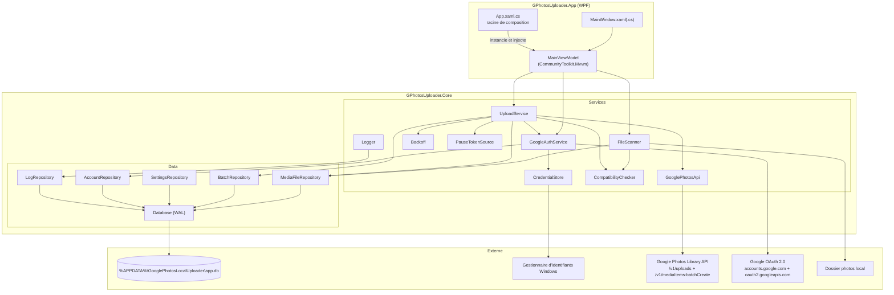
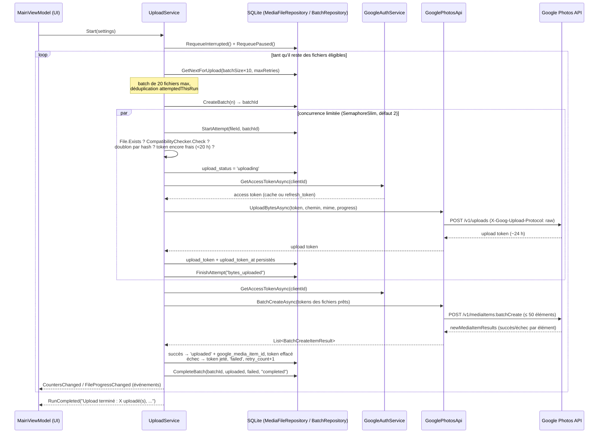

# Architecture — Google Photos Local Uploader

> Document technique destiné aux développeurs. Il décrit l'architecture réelle du code
> présent dans ce dépôt ; chaque comportement décrit ici a été vérifié dans les sources.

## 1. Vue d'ensemble

Google Photos Local Uploader est une application de bureau Windows 10/11 (WPF, .NET 8, C#)
qui :

1. **scanne** récursivement un dossier local d'images,
2. **indexe** chaque fichier dans une base SQLite locale (chemin, taille, dates, hash SHA-256),
3. **uploade** les fichiers par batchs vers Google Photos via l'API HTTP officielle
   (Library API), avec **reprise après interruption** : chaque transition d'état est
   persistée en base, si bien qu'une fermeture, un crash ou une coupure réseau ne fait
   jamais perdre le travail accompli.

Principes non négociables, appliqués dans le code :

- L'application **ne supprime jamais** un fichier local ni un média Google Photos.
- Les secrets (refresh token OAuth, client secret) sont stockés dans le
  **Gestionnaire d'identifiants Windows** (`advapi32` / `CredWriteW`), jamais en clair sur le disque.
- Aucune capacité API n'est supposée au-delà de ce que Google documente : depuis les
  changements du **31 mars 2025**, la Google Photos Library API ne permet de relire que
  les médias créés par l'application elle-même. L'interface affiche donc franchement :
  « Google Photos ne permet pas à cette application de vérifier toute votre bibliothèque.
  La détection des doublons est garantie uniquement pour les fichiers déjà indexés
  localement ou uploadés par cette application. »
  (constante `MainViewModel.DuplicateDisclaimer`).

## 2. Choix de la pile : WPF + .NET 8

Le besoin est une application **Windows uniquement**, durable, avec accès natif à des
API Windows (Gestionnaire d'identifiants via P/Invoke `advapi32`), un traitement de
fichiers intensif (hash SHA-256, streaming HTTP de gros fichiers) et une interface
riche mais classique (onglets, tableaux, barres de progression).

| Critère | **WPF / .NET 8 (choisi)** | .NET MAUI | Avalonia | Electron |
|---|---|---|---|---|
| Cible | Windows desktop, mature depuis 2006 | Mobile d'abord ; le desktop Windows passe par WinUI 3, écosystème encore jeune | Multiplateforme, mais apporte une couche d'abstraction inutile pour du Windows-only | Multiplateforme via Chromium |
| Accès natif Windows (Credential Manager, `HttpListener` loopback) | Direct (P/Invoke trivial, même runtime) | Possible mais à travers des abstractions par plateforme | Possible mais hors du cœur du framework | Nécessite des modules natifs Node ou des ponts |
| Empreinte | Exécutable self-contained raisonnable, un seul processus .NET | Comparable, mais dépendances Windows App SDK | Comparable | Un Chromium complet embarqué (~200 Mo, plusieurs processus, RAM élevée) |
| Performance I/O + hash + upload en tâche de fond | Excellente : `Task`, `async/await`, streams .NET natifs | Équivalente (même runtime) mais sans bénéfice ici | Équivalente | JavaScript/Node : correct mais moins adapté au streaming binaire contrôlé |
| Outillage / tests | `dotnet build`, `dotnet test`, xUnit, MVVM éprouvé (CommunityToolkit.Mvvm) | En cours de stabilisation | Bon mais plus petit écosystème | Écosystème web, mais tests desktop plus lourds |
| Longévité | Composant supporté de .NET 8 (LTS) | Cadence de changements élevée | Projet open source dynamique mais externe à Microsoft | Dépend du rythme Chromium |

Conclusion : pour une application **exclusivement Windows**, sans besoin web ni mobile,
WPF sur .NET 8 est le choix le plus simple, le plus stable et le plus performant.
MAUI et Avalonia paieraient un coût d'abstraction multiplateforme sans bénéfice ;
Electron paierait en plus un coût mémoire/poids injustifiable pour un uploader de fichiers.

Autre choix structurant : **pas de SDK Google**. Le client .NET officiel PhotosLibrary
est déprécié ; l'application parle donc **HTTP directement** (deux endpoints seulement,
voir §6), ce qui supprime une dépendance morte et rend le comportement réseau
entièrement auditable dans `GooglePhotosApi.cs`.

## 3. Découpage de la solution

```
GooglePhotosUploader.sln
├── src/GPhotosUploader.Core/     Logique métier pure (aucune dépendance WPF)
│   ├── Models/                   Enums, MediaFile, AppSettings, GoogleAccount, UploadBatch
│   ├── Data/                     Database, Migrations, *Repository (SQLite)
│   └── Services/                 Scan, auth, API, upload, journalisation…
├── src/GPhotosUploader.App/      Couche présentation WPF (MVVM)
│   ├── App.xaml(.cs)             Racine de composition (instanciation des services)
│   ├── MainWindow.xaml(.cs)      Fenêtre principale + fermeture propre
│   ├── Views/OAuthWizardWindow   Assistant Google Cloud (6 étapes, liens console, import JSON)
│   └── ViewModels/               MainViewModel, OAuthWizardViewModel
├── src/GPhotosUploader.Tests/    xUnit : CoreLogic, Database, FileScanner, OAuthClientConfig (54 tests)
├── build/build.ps1, build/publish.ps1
├── scripts/setup-google-cloud.ps1  (Optionnel) gcloud : projet + activation API (le client OAuth
│                                   « Application de bureau » n'est automatisable par aucune API)
└── installer/setup.iss           Installeur Inno Setup
```

- **`GPhotosUploader.Core`** ne référence ni WPF ni quoi que ce soit d'UI : il est
  testable en console et par xUnit. Tout ce qui touche à SQLite, au réseau, à OAuth et
  à la machine à états d'upload vit ici.
- **`GPhotosUploader.App`** ne contient aucune logique métier : `App.xaml.cs` est la
  *racine de composition* (elle construit `Database`, les dépôts, `HttpClient`,
  `GoogleAuthService`, `GooglePhotosApi`, `FileScanner`, `UploadService`, puis injecte
  tout dans `MainViewModel`). L'injection est manuelle, sans conteneur DI : le graphe
  d'objets est petit et entièrement visible dans `OnStartup`.
- **`GPhotosUploader.Tests`** couvre la logique Core (backoff, compatibilité, pause,
  migrations, dépôts, scanner) — 54 tests, tous verts.

## 4. Responsabilité de chaque service (`src/GPhotosUploader.Core/Services/`)

| Fichier | Responsabilité |
|---|---|
| `AppPaths.cs` | Emplacements des données locales : `%APPDATA%\GooglePhotosLocalUploader\` (`app.db`, `logs\app-YYYYMMDD.log`). |
| `Logger.cs` | Journalisation triple : fichier texte quotidien, table SQLite `app_logs` (hors niveau Debug), et événement `MessageLogged` pour l'affichage temps réel dans l'UI. Ne doit jamais recevoir de donnée sensible (token, secret). Un échec d'écriture du journal ne fait jamais tomber l'application. |
| `CredentialStore.cs` | Lecture/écriture/suppression des secrets dans le Gestionnaire d'identifiants Windows via P/Invoke `advapi32` (`CredWriteW`, `CredReadW`, `CredDeleteW`). Cibles exactes : `GooglePhotosLocalUploader/RefreshToken` et `GooglePhotosLocalUploader/OAuthClientSecret`. |
| `CompatibilityChecker.cs` | Vérifie qu'un fichier est acceptable : extension présente dans `AppSettings.IncludedExtensions` (liste configurable, défaut : jpg, jpeg, png, webp, heic, heif, gif, tif, tiff, bmp, avif, ico + RAW dng, cr2, cr3, crw, nef, nrw, arw, orf, raf, rw2, srw, pef, srf, sr2), non vide, taille ≤ 200 Mo (limite photo Google Photos). Fournit aussi le type MIME transmis à l'endpoint d'upload (`MimeTypeFor`). |
| `FileScanner.cs` | Scan récursif du dossier racine (`EnumerationOptions` : sous-dossiers, ignore les inaccessibles, saute reparse points et fichiers système). Pour chaque image : si taille + date de modification inchangées et hash déjà connu → simple mise à jour de `last_seen_at` (pas de re-hash) ; sinon calcul SHA-256, détection de doublons par hash (déjà uploadé → `skipped_duplicate_remote_app_created` ; doublon local → `skipped_duplicate_local`), passage en `queued`. Un contenu modifié remet le fichier à zéro (statut, token, compteur d'essais). Ne rétrograde jamais un fichier `uploaded`. En fin de scan, les fichiers sous la racine non revus passent en `scan_status = 'missing'`. |
| `PauseTokenSource.cs` | Jeton de pause coopératif : l'orchestrateur appelle `WaitWhilePausedAsync` entre chaque étape et se fige tant que la pause est active ; `Resume` libère toutes les attentes. |
| `GoogleAuthService.cs` | OAuth 2.0 **Authorization Code + PKCE** pour application installée : ouverture du navigateur par défaut, `HttpListener` sur `http://127.0.0.1:{port}/` (port libre choisi dynamiquement), vérification du `state`, échange du code, timeout de 5 minutes. Scopes exacts : `photoslibrary.appendonly`, `photoslibrary.readonly.appcreateddata`, `openid`, `email`. Cache l'access token en mémoire (expiration moins 60 s de marge), le rafraîchit sous verrou (`SemaphoreSlim`) pour éviter les rafraîchissements concurrents, lève `AuthRequiredException` si le refresh token est refusé (400/401) — signe que la session Google est expirée ou révoquée. `SignOutAsync` révoque le token au mieux (tolère le hors-ligne) puis efface les secrets locaux. |
| `GooglePhotosApi.cs` | Client HTTP minimal de la Library API, **deux endpoints seulement** : `POST https://photoslibrary.googleapis.com/v1/uploads` (octets bruts, en-têtes `X-Goog-Upload-Protocol: raw` et `X-Goog-Upload-Content-Type`, streaming avec progression via `ProgressReadStream`) → upload token ; `POST https://photoslibrary.googleapis.com/v1/mediaItems:batchCreate` (max 50 éléments, `AppSettings.MaxBatchSize`). Classe chaque erreur HTTP en transitoire/permanente et extrait `Retry-After` (voir §8). |
| `Backoff.cs` | Backoff exponentiel : base 1 s, doublement par tentative, **plafond 60 s**, jitter aléatoire 0–500 ms ; un `Retry-After` fourni par Google est honoré en priorité (borné au plafond). |
| `UploadService.cs` | Orchestrateur d'upload (détaillé en §6 et §7) : consomme la file `queued` par batchs (défaut 20 fichiers), obtient les upload tokens avec concurrence limitée (`SemaphoreSlim`, 1–3, défaut 2), appelle `batchCreate`, persiste **chaque** transition d'état dans SQLite, gère pause/reprise/arrêt, débit sur fenêtre glissante de 30 s et estimation du temps restant. |

Côté données (`src/GPhotosUploader.Core/Data/`) : `Database.cs` ouvre SQLite en mode
**WAL** avec `busy_timeout=5000` et `foreign_keys=ON` (résistance aux arrêts brutaux et
aux accès concurrents scan + upload + UI) ; `Migrations.cs` applique des scripts
versionnés en transaction (table `schema_version`) ; les dépôts (`MediaFileRepository`,
`SettingsRepository`, `AccountRepository`, `BatchRepository`, `LogRepository`) sont les
seuls points d'accès SQL, tous paramétrés.

## 5. Diagramme des composants



## 6. Séquence d'un upload

Le flux pour un batch (défaut : 20 fichiers, 2 uploads d'octets simultanés) :

1. **Phase 1 — octets** : pour chaque fichier, `POST /v1/uploads` avec les octets bruts
   → **upload token** (valide ~24 h côté Google ; l'application le considère frais
   pendant **20 h**, constante `UploadTokenLifetime`).
2. **Phase 2 — création** : un seul `POST /v1/mediaItems:batchCreate` avec tous les
   tokens du batch (limite dure : 50 éléments par appel).



Avant chaque upload d'octets, `PrepareUploadTokenAsync` revérifie dans l'ordre :
existence du fichier sur disque, compatibilité avec les paramètres **courants**,
doublon d'un fichier déjà uploadé (par hash), et présence d'un upload token encore
frais — auquel cas les octets ne sont **pas renvoyés** (résultat d'attempt
`token_reused` dans `upload_attempts`).

## 7. Stratégie de reprise après interruption

La règle générale : **SQLite est la source de vérité**. Chaque fichier porte un
`upload_status` (`discovered`, `queued`, `uploading`, `uploaded`,
`skipped_duplicate_local`, `skipped_duplicate_remote_app_created`,
`skipped_incompatible`, `failed`, `paused`) et un `scan_status` (`scanned`, `missing`),
mis à jour à chaque étape. La base est en mode WAL, donc cohérente même après un arrêt
brutal.

| Cas | Comportement vérifié dans le code |
|---|---|
| **Fermeture de la fenêtre** | `MainWindow.OnClosing` annule la fermeture, appelle `MainViewModel.ShutdownAsync()` (annulation du scan, `UploadService.StopAsync()`), puis ferme réellement. L'annulation fait passer les fichiers `uploading` en **`paused`** (`MarkUploadingAsPaused`). Au prochain lancement de l'upload, `RequeuePaused()` les remet en `queued`. |
| **Crash / coupure de courant** | Aucun code ne s'exécute, mais les statuts déjà persistés survivent (WAL). Au démarrage suivant, `App.OnStartup` appelle `UploadService.RecoverAfterRestart()` : tout fichier resté `uploading` redevient `queued` (`RequeueInterrupted`). Si un upload token avait été obtenu et persisté avant le crash (crash **entre** l'upload des octets et le `batchCreate`), il est **réutilisé tel quel** s'il a moins de 20 h : les octets ne sont pas renvoyés. |
| **Perte réseau** | Les erreurs `HttpRequestException` et les 5xx/429 sont retentées dans la même tentative (jusqu'à 3 relances internes, `InAttemptTransientRetries`, avec backoff). Au-delà, le fichier passe en `failed` avec `retry_count + 1` — il sera repris tant que `retry_count < MaxRetries` (défaut 5). Après **5 échecs transitoires consécutifs** tous fichiers confondus (`ConsecutiveTransientLimit`), le disjoncteur arrête tout le run (voir §8) ; les fichiers `uploading` repassent en `paused`. |
| **Access token expiré (401 en cours d'upload)** | `InvalidateAccessToken()` puis nouvel essai : `GetAccessTokenAsync` rafraîchit via le refresh token (sous verrou pour éviter les doubles refresh). Transparent pour l'utilisateur. |
| **Refresh token expiré ou révoqué** | Le refresh renvoie 400/401 → `AuthRequiredException`. Le run s'interrompt proprement : fichiers `uploading` → `paused`, événement `AuthenticationLost` → l'UI affiche « Session Google expirée : reconnectez votre compte puis relancez l'upload. » Rien n'est perdu ; après reconnexion, l'upload reprend où il en était. |
| **Fichier disparu (déplacé/supprimé depuis le scan)** | Vérifié juste avant l'upload : `File.Exists` échoue → `scan_status = 'missing'`, statut `failed` avec le message « Fichier introuvable (déplacé ou supprimé depuis le scan). », marqué **permanent** (le `retry_count` est porté à `MaxRetries` pour ne pas retenter en boucle). Le scan marque aussi `missing` les fichiers non revus sous la racine (sauf ceux déjà `uploaded`). |
| **Échec du `batchCreate` entier (erreur permanente)** | Les fichiers du batch repassent en `queued` et leurs upload tokens **restent en base** : au prochain passage, s'ils sont encore frais, seuls les `batchCreate` seront rejoués, sans renvoyer les octets. |
| **Échec d'un élément individuel du `batchCreate`** | Le token est considéré consommé ou refusé : il est **jeté** (`upload_token = NULL`) et le fichier passe en `failed` (transitoire) — les octets seront renvoyés à la tentative suivante. |
| **Pause utilisateur** | `PauseTokenSource` : le fichier en cours **se termine** (l'attente n'est vérifiée qu'entre les étapes), puis le pipeline se fige sans rien perdre. `Resume` repart instantanément. |
| **Fichier en erreur épuisé** | Un fichier `failed` avec `retry_count ≥ MaxRetries` n'est plus sélectionné. Le bouton « remettre en file » de l'UI appelle `MediaFileRepository.ResetFailed()` (retry_count remis à 0, statut `queued`, erreur effacée). |

Garantie anti-boucle dans un même run : `RunAsync` tient un `HashSet` `attemptedThisRun`
— un fichier n'est tenté qu'une fois par run, même s'il retombe en `failed` relançable.

## 8. Gestion des erreurs

### Classification transitoire / permanente

`GooglePhotosApi.ClassifyError` produit une `GooglePhotosApiException` portant
`StatusCode`, `IsTransient` et `RetryAfter` :

| Statut HTTP | Classification | Traitement |
|---|---|---|
| **429** | Transitoire | Relance avec backoff ; message « Limite de requêtes Google Photos atteinte (429). Nouvel essai automatique. » |
| **≥ 500** | Transitoire | Relance avec backoff. |
| **403** contenant `quota` ou `rate` dans le message d'erreur Google | Transitoire | Relance avec backoff (quota/limite de débit). |
| **403** (autre) | Permanente | Fichier en `failed`, `retry_count` porté au maximum (pas de relance automatique). |
| **401** | Cas spécial | Ni transitoire ni permanente : invalidation du token en cache + refresh, puis nouvel essai. Si le refresh lui-même échoue → `AuthRequiredException` (reconnexion requise). |
| **408 / 425** | Transitoire | Relance avec backoff (timeouts rejouables par définition, RFC 9110). |
| Timeout du `HttpClient` (`TaskCanceledException` sans annulation utilisateur) | Transitoire | Reclassée en `GooglePhotosApiException` transitoire : backoff/relance, sans être confondue avec un arrêt volontaire. |
| Autres 4xx | Permanente | `failed`, non relancé automatiquement. |
| `HttpRequestException` (réseau) | Transitoire | Relances internes, puis `failed` avec `retry_count + 1` ; compte dans le disjoncteur réseau. |
| `IOException` / `UnauthorizedAccessException` (erreur locale : fichier verrouillé, placeholder cloud...) | Transitoire | `failed` avec `retry_count + 1`, mais **ne compte pas** dans le disjoncteur réseau. |

Deux niveaux de relance se combinent :

1. **Dans la tentative** : jusqu'à 3 relances internes (`InAttemptTransientRetries`)
   avec backoff, pour absorber les hoquets courts sans toucher au statut du fichier.
2. **Entre les runs** : un fichier `failed` transitoire est repris tant que
   `retry_count < MaxRetries` (défaut 5, configurable 0–20).

### Backoff

`Backoff.For(attempt, retryAfterHint)` :

- si Google fournit un en-tête `Retry-After` (durée ou date), il est **honoré en
  priorité**, borné à 60 s ;
- sinon : `1 s × 2^attempt`, plafonné à **60 s**, plus un **jitter** aléatoire de
  0–500 ms pour désynchroniser les clients.

### Disjoncteur (circuit breaker)

`UploadService` compte les échecs **réseau consécutifs** tous fichiers confondus
(`_consecutiveTransient`, remis à zéro à chaque succès ; les erreurs locales de type
fichier verrouillé n'y participent pas). Au 5ᵉ
(`ConsecutiveTransientLimit`), `RegisterTransientFailure` lève :
« Trop d'erreurs réseau consécutives. Vérifiez la connexion Internet puis relancez
l'upload. » Le run entier s'arrête proprement (fichiers `uploading` → `paused`) plutôt
que de marquer `failed` des centaines de fichiers pendant une coupure réseau prolongée.

### Erreurs UI

`App.xaml.cs` installe un gestionnaire `DispatcherUnhandledException` : toute exception
non gérée sur le thread UI est journalisée, affichée dans une boîte de dialogue, et
marquée gérée — l'application ne se ferme pas brutalement.

## 9. Threading et marshaling vers l'UI

- **Thread UI (Dispatcher WPF)** : uniquement l'affichage et les commandes MVVM.
  Aucun hash, aucun appel réseau, aucune requête SQLite longue n'y est exécuté.
- **Scan** : `FileScanner.ScanAsync` enveloppe l'énumération + hash dans un `Task.Run` ;
  la progression remonte via `IProgress<ScanProgress>` (le `Progress<T>` créé sur le
  thread UI rebascule automatiquement dessus).
- **Upload** : `UploadService.Start` lance `RunAsync` dans un `Task.Run`. À l'intérieur
  d'un batch, la phase « octets » est parallélisée par un `SemaphoreSlim(Concurrency)`
  (1 à 3 workers, défaut 2) ; la phase `batchCreate` est un appel unique. Les compteurs
  partagés utilisent `Interlocked`, l'état du service est protégé par `_stateLock`, et
  la fenêtre de débit par `_rateLock`.
- **Pause/annulation coopératives** : `PauseTokenSource.WaitWhilePausedAsync(ct)` et
  `CancellationToken` sont vérifiés entre chaque étape — jamais au milieu d'une
  écriture SQLite, ce qui garantit des états cohérents en base.
- **Marshaling** : `UploadService` et `Logger` publient des événements .NET ordinaires
  (`StateChanged`, `CountersChanged`, `FileProgressChanged`, `RunCompleted`,
  `AuthenticationLost`, `MessageLogged`) **depuis les threads de travail**. C'est
  `MainViewModel` qui rebascule systématiquement vers le thread UI via `RunOnUi`
  (`Dispatcher.CheckAccess()` puis `Dispatcher.BeginInvoke`). Les événements de
  progression fichier (émis tous les ~128 Ko lus) sont **throttlés à 10 mises à jour/s**
  côté ViewModel pour ne pas saturer le Dispatcher.
- **SQLite concurrent** : chaque opération de dépôt ouvre sa propre connexion
  (mode WAL + `busy_timeout=5000`), ce qui permet la coexistence scan / upload / UI
  sans verrou applicatif global.
- **Fermeture** : `MainWindow.OnClosing` est asynchrone mais garde la fenêtre ouverte
  (`e.Cancel = true`) tant que `ShutdownAsync` n'a pas terminé l'arrêt propre.

## 10. Limites assumées

- **Pas de détection de doublons contre toute la bibliothèque Google Photos** : l'API
  ne le permet plus depuis le 31 mars 2025 (scope de lecture limité à
  `readonly.appcreateddata`). Un fichier déjà présent dans Google Photos mais uploadé
  par un autre moyen **sera dupliqué**. L'UI l'annonce explicitement (voir §1).
- **Stockage** : les uploads comptent dans le quota de stockage du compte Google
  (qualité d'origine) ; l'API ne propose pas l'option « économiseur de stockage ».
- **200 Mo maximum par photo** (limite Google Photos) ; les fichiers plus gros sont
  marqués `skipped_incompatible` avec la raison exacte.
- **L'utilisateur crée son propre client OAuth** dans Google Cloud Console (type
  « Application de bureau ») : l'application ne distribue aucun secret. Le Client ID est
  stocké en SQLite (non secret) ; le Client Secret et le refresh token vont dans le
  Gestionnaire d'identifiants Windows.
- **Compatibilité par extension et taille uniquement** : `CompatibilityChecker` ne
  décode pas les fichiers ; un fichier corrompu passera le filtre local et sera refusé
  par Google au `batchCreate` (l'erreur retournée par Google est alors enregistrée
  dans `last_error`).
- **Upload « raw » non repris au milieu d'un fichier** : si l'envoi des octets d'un
  fichier est interrompu, il recommence depuis le début de ce fichier (le protocole
  `raw` utilisé n'offre pas de reprise partielle) ; en revanche, un upload token déjà
  obtenu évite tout renvoi d'octets.

## 11. Build et distribution

- **Compilation / tests** : `dotnet build` et `dotnet test` sur `GooglePhotosUploader.sln`
  (script `build/build.ps1`).
- **Publication** : `build/publish.ps1` produit un exécutable **self-contained win-x64**
  dans `dist\win-x64\` (`GooglePhotosLocalUploader.exe`) — aucune installation de .NET
  requise sur la machine cible.
- **Installeur** : `installer/setup.iss` (Inno Setup).
- **Données locales** : tout vit sous `%APPDATA%\GooglePhotosLocalUploader\` ; le bouton
  « Supprimer les données locales » de l'UI arrête l'upload, déconnecte le compte
  (révocation + effacement des secrets), vide les pools SQLite et supprime le dossier —
  sans jamais toucher aux photos locales ni aux médias Google Photos.
