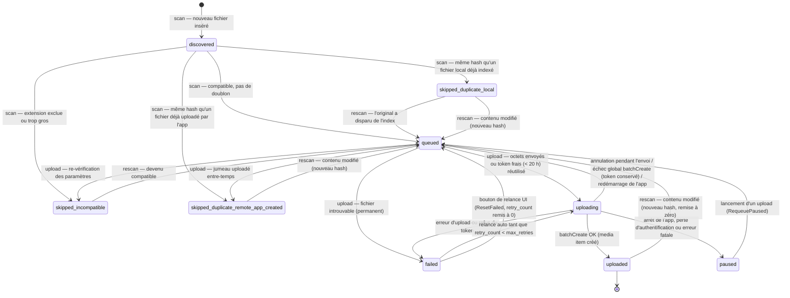

# Schéma de la base de données SQLite

> Document technique destiné aux développeurs. Sources de référence :
> `src/GPhotosUploader.Core/Data/Migrations.cs`, `src/GPhotosUploader.Core/Data/Database.cs`,
> `src/GPhotosUploader.Core/Models/Enums.cs` et les dépôts (`*Repository.cs`) du dossier `src/GPhotosUploader.Core/Data/`.

## Vue d'ensemble

Toutes les données locales de l'application sont stockées dans une base SQLite unique :

- **Fichier** : `%APPDATA%\GooglePhotosLocalUploader\app.db` (constante `AppPaths.DatabasePath`).
- **Accès** : `Microsoft.Data.Sqlite`, sans ORM ; SQL écrit à la main dans les dépôts (`MediaFileRepository`, `SettingsRepository`, `AccountRepository`, `BatchRepository`, `LogRepository`).
- **Dates** : toutes les dates sont stockées en `TEXT` au format ISO 8601 UTC (« roundtrip » `"o"`, ex. `2026-07-11T14:32:05.1234567Z`) via `Database.ToDbDate` / `Database.FromDbDate`.
- **Contenu sensible** : la base ne contient **aucun secret**. Le refresh token OAuth et le client secret sont conservés dans le Gestionnaire d'identifiants Windows (`CredentialStore`, `advapi32` CredWrite). Seul le **client ID** OAuth (donnée non secrète) est stocké dans la table `settings`.
- **Suppression** : l'UI propose un bouton de suppression totale des données locales (`%APPDATA%\GooglePhotosLocalUploader\`, base + logs). L'application ne supprime jamais de fichier local scanné ni de média sur Google Photos.

## Ouverture des connexions : WAL et busy_timeout

Chaque connexion est ouverte par `Database.OpenConnection()`, qui exécute systématiquement :

```sql
PRAGMA journal_mode=WAL; PRAGMA busy_timeout=5000; PRAGMA foreign_keys=ON;
```

- **`journal_mode=WAL`** (Write-Ahead Logging) : les écritures passent par un journal séparé (`app.db-wal`), ce qui rend la base résistante aux arrêts brutaux (crash, coupure de courant) et permet des lectures concurrentes pendant les écritures.
- **`busy_timeout=5000`** : si la base est momentanément verrouillée par une autre connexion, SQLite réessaie pendant 5 secondes avant de renvoyer une erreur. Nécessaire car le scan, l'upload et l'interface utilisateur ouvrent chacun leurs propres connexions courtes.
- **`foreign_keys=ON`** : active la vérification des clés étrangères (désactivée par défaut dans SQLite), utilisée par `upload_attempts`.

## Migrations versionnées

Le schéma évolue par **migrations ordonnées et idempotentes**, définies dans `Migrations.All`
(liste de couples `(Version, Script)` dans `src/GPhotosUploader.Core/Data/Migrations.cs`) et appliquées
par `Database.Migrate()` à chaque construction de l'objet `Database` (donc à chaque démarrage) :

1. Création de la table `schema_version` si elle n'existe pas (`CREATE TABLE IF NOT EXISTS schema_version (version INTEGER NOT NULL)`).
2. Lecture de la version courante : `SELECT COALESCE(MAX(version), 0) FROM schema_version`.
3. Pour chaque migration dont la version est **strictement supérieure** à la version courante :
   - exécution du script SQL **dans une transaction** ;
   - insertion de la version dans `schema_version` dans la **même transaction** ;
   - `COMMIT`. En cas d'échec, la transaction est annulée et le schéma reste cohérent.

La version actuelle du schéma est **1** (script unique de création). Pour faire évoluer le schéma :
ajouter une entrée `(2, "ALTER TABLE ...")` à `Migrations.All` — ne jamais modifier un script déjà publié.

## Tables

### `schema_version`

Suivi des migrations appliquées.

| Colonne | Type | Rôle |
|---|---|---|
| `version` | `INTEGER NOT NULL` | Numéro d'une migration appliquée. La version courante du schéma est `MAX(version)`. |

### `settings`

Paramètres applicatifs en clé/valeur (classe `AppSettings`, dépôt `SettingsRepository`). Écrits en `INSERT ... ON CONFLICT(key) DO UPDATE`.

| Colonne | Type | Rôle |
|---|---|---|
| `key` | `TEXT PRIMARY KEY` | Nom du paramètre. |
| `value` | `TEXT` | Valeur, toujours sérialisée en texte (culture invariante pour les nombres). |

Clés utilisées et bornes (méthode `AppSettings.Clamp()`) :

| Clé | Défaut | Bornes | Rôle |
|---|---|---|---|
| `root_folder` | `""` | — | Dossier racine à scanner. |
| `batch_size` | `20` | 1–50 | Fichiers par batch. La borne 50 est la limite dure de `mediaItems:batchCreate`. |
| `max_retries` | `5` | 0–20 | Tentatives maximum pour un fichier en échec temporaire. |
| `concurrency` | `2` | 1–3 | Uploads d'octets simultanés. |
| `max_file_size_mb` | `200` | 1–200 | Taille maximum acceptée par photo (limite Google Photos : 200 Mo). |
| `included_extensions` | `jpg,jpeg,png,webp,heic,heif,gif,tif,tiff,bmp,avif,ico,dng,cr2,cr3,crw,nef,nrw,arw,orf,raf,rw2,srw,pef,srf,sr2` | — | Extensions incluses, séparées par des virgules, sans point, en minuscules. |
| `oauth_client_id` | `""` | — | Client ID OAuth créé par l'utilisateur dans Google Cloud Console (type « Application de bureau »). Non secret : le client secret et le refresh token sont, eux, dans le Gestionnaire d'identifiants Windows. |

### `google_account`

Compte Google connecté. Table à **ligne unique** (contrainte `CHECK (id = 1)`), dépôt `AccountRepository`. La déconnexion supprime la ligne (`DELETE ... WHERE id = 1`).

| Colonne | Type | Rôle |
|---|---|---|
| `id` | `INTEGER PRIMARY KEY CHECK (id = 1)` | Toujours `1` : au plus un compte connecté. |
| `email` | `TEXT` | Adresse e-mail du compte Google (obtenue via le scope `email`). |
| `display_name` | `TEXT` | Nom d'affichage du compte. |
| `connected_at` | `TEXT` | Date/heure de connexion (ISO 8601 UTC). |
| `scopes` | `TEXT` | Scopes OAuth accordés (`photoslibrary.appendonly`, `photoslibrary.readonly.appcreateddata`, `openid`, `email`). |

### `media_files`

Cœur de l'application : l'inventaire local et la **machine à états** de l'upload (dépôt `MediaFileRepository`, modèle `MediaFile`). Une ligne par fichier image découvert sous le dossier racine.

| Colonne | Type | Rôle |
|---|---|---|
| `id` | `INTEGER PRIMARY KEY AUTOINCREMENT` | Identifiant interne. |
| `local_path` | `TEXT NOT NULL UNIQUE` | Chemin absolu du fichier. L'unicité garantit qu'un rescan ne crée jamais de doublon en base. |
| `file_name` | `TEXT NOT NULL` | Nom du fichier (avec extension). |
| `extension` | `TEXT NOT NULL` | Extension en minuscules, sans point (ex. `jpg`). |
| `file_size` | `INTEGER NOT NULL` | Taille en octets. |
| `sha256_hash` | `TEXT` | Empreinte SHA-256 du contenu, en hexadécimal minuscule. `NULL` tant que le fichier n'a pas été hashé (ex. fichier incompatible). Sert à la détection de doublons et de modifications. |
| `created_at` | `TEXT` | Date de création du fichier sur disque (UTC). |
| `modified_at` | `TEXT` | Date de dernière modification sur disque (UTC). Avec `file_size`, permet d'éviter de re-hasher un fichier inchangé au rescan (tolérance de 2 s). |
| `scan_status` | `TEXT NOT NULL DEFAULT 'scanned'` | `scanned` ou `missing` (voir « Statuts » ci-dessous). |
| `upload_status` | `TEXT NOT NULL DEFAULT 'discovered'` | État du cycle de vie d'upload (voir « Statuts » ci-dessous). |
| `google_media_item_id` | `TEXT` | Identifiant du média créé dans Google Photos après `batchCreate`. Pour un doublon (`skipped_duplicate_remote_app_created`), reprend l'identifiant du jumeau déjà uploadé. |
| `upload_token` | `TEXT` | Upload token renvoyé par `POST /v1/uploads` (octets déjà transmis, média pas encore créé). Effacé après `batchCreate` (succès ou refus du token). |
| `upload_token_at` | `TEXT` | Date d'obtention du token. Google annonce une validité d'environ 24 h ; l'application ne le réutilise que s'il a **moins de 20 h** (`UploadService.UploadTokenLifetime`), sinon les octets sont renvoyés. |
| `retry_count` | `INTEGER NOT NULL DEFAULT 0` | Nombre de tentatives en échec. Un fichier `failed` est relancé tant que `retry_count < max_retries` ; un échec permanent force `retry_count` au maximum pour ne plus être relancé. |
| `last_error` | `TEXT` | Dernier message d'erreur ou raison d'exclusion (incompatibilité, doublon). |
| `first_seen_at` | `TEXT NOT NULL` | Première découverte par un scan (UTC). |
| `last_seen_at` | `TEXT NOT NULL` | Dernière fois que le fichier a été vu par un scan. Sert à détecter les fichiers disparus (`missing`). |
| `uploaded_at` | `TEXT` | Date de création réussie du média dans Google Photos. |

Index :

- `idx_media_files_upload_status` sur `upload_status` — sélection rapide de la file d'attente (`GetNextForUpload`) et des compteurs par statut (`CountByStatus`).
- `idx_media_files_hash` sur `sha256_hash` — recherche de doublons (`FindUploadedByHash`, `FindLocalDuplicate`).
- Index unique implicite créé par la contrainte `UNIQUE` sur `local_path` — recherche par chemin au rescan (`GetByPath`).

### `upload_batches`

Historique des batchs d'upload (dépôt `BatchRepository`, modèle `UploadBatch`). Un batch = jusqu'à `batch_size` fichiers : phase 1, obtention des upload tokens (concurrence limitée) ; phase 2, un appel `mediaItems:batchCreate`.

| Colonne | Type | Rôle |
|---|---|---|
| `id` | `INTEGER PRIMARY KEY AUTOINCREMENT` | Identifiant du batch. |
| `created_at` | `TEXT NOT NULL` | Début du batch (UTC). |
| `completed_at` | `TEXT` | Fin du batch ; `NULL` tant qu'il est en cours. |
| `file_count` | `INTEGER NOT NULL` | Nombre de fichiers pris dans le batch. |
| `success_count` | `INTEGER NOT NULL DEFAULT 0` | Fichiers effectivement créés dans Google Photos. |
| `failure_count` | `INTEGER NOT NULL DEFAULT 0` | Fichiers en échec dans ce batch. |
| `status` | `TEXT NOT NULL` | `running` (en cours), puis `completed` (terminé) ou `stopped` (interrompu par un arrêt/annulation). |

### `upload_attempts`

Trace de chaque tentative d'upload d'un fichier (dépôt `BatchRepository`). Utile pour le diagnostic : on voit combien de fois un fichier a été essayé, quand, et avec quel résultat.

| Colonne | Type | Rôle |
|---|---|---|
| `id` | `INTEGER PRIMARY KEY AUTOINCREMENT` | Identifiant de la tentative. |
| `media_file_id` | `INTEGER NOT NULL REFERENCES media_files(id)` | Fichier concerné (clé étrangère, `foreign_keys=ON`). |
| `batch_id` | `INTEGER REFERENCES upload_batches(id)` | Batch dans lequel la tentative a eu lieu (nullable). |
| `started_at` | `TEXT NOT NULL` | Début de la tentative (UTC). |
| `finished_at` | `TEXT` | Fin de la tentative ; `NULL` si l'application s'est arrêtée en plein milieu. |
| `outcome` | `TEXT` | Résultat : `bytes_uploaded` (octets envoyés, token obtenu), `token_reused` (token encore frais réutilisé, octets non renvoyés), `skipped` (incompatible ou doublon), `failed`, `cancelled` (annulation utilisateur). |
| `error` | `TEXT` | Message d'erreur ou raison du skip, le cas échéant. |

Index : `idx_upload_attempts_file` sur `media_file_id` — historique des tentatives d'un fichier.

### `app_logs`

Journal persistant de l'application (dépôt `LogRepository`), en complément des fichiers texte `%APPDATA%\GooglePhotosLocalUploader\logs\app-AAAAMMJJ.log`. Purgeable par ancienneté (`Purge(keepDays)`).

| Colonne | Type | Rôle |
|---|---|---|
| `id` | `INTEGER PRIMARY KEY AUTOINCREMENT` | Identifiant de l'entrée. |
| `timestamp` | `TEXT NOT NULL` | Horodatage (ISO 8601 UTC). |
| `level` | `TEXT NOT NULL` | Niveau en minuscules : `debug`, `info`, `warning`, `error` (enum `AppLogLevel`). |
| `source` | `TEXT` | Composant émetteur (ex. `Scan`, `Upload`), nullable. |
| `message` | `TEXT NOT NULL` | Message. |

Index : `idx_app_logs_timestamp` sur `timestamp` — affichage chronologique et purge par date.

## Statuts

Les valeurs texte stockées en base sont définies par `StatusMapper` (`src/GPhotosUploader.Core/Models/Enums.cs`). Toute valeur inconnue lève une exception à la lecture : la liste ci-dessous est exhaustive.

### `scan_status`

| Valeur | Signification |
|---|---|
| `scanned` | Le fichier a été vu par le dernier scan de son dossier racine. |
| `missing` | Le fichier n'a pas été revu par le scan courant (`MarkMissingUnderRoot` : `last_seen_at` antérieur au début du scan, et `upload_status != 'uploaded'`), ou il a disparu entre le scan et l'upload. Un fichier retrouvé lors d'un scan ultérieur repasse à `scanned`. |

### `upload_status`

| Valeur | Signification |
|---|---|
| `discovered` | Fichier découvert, pas encore classé (état par défaut à l'insertion ; transitoire pendant le scan). |
| `queued` | En file d'attente d'upload. |
| `uploading` | Upload en cours (octets envoyés et/ou en attente de `batchCreate`). |
| `uploaded` | Média créé dans Google Photos (`google_media_item_id` et `uploaded_at` renseignés). État final, sauf si le contenu du fichier change (nouveau hash) : il est alors remis en file. |
| `skipped_duplicate_local` | Ignoré : un autre fichier local **déjà indexé** (id plus petit) a le même hash SHA-256. |
| `skipped_duplicate_remote_app_created` | Ignoré : un fichier de même hash a **déjà été uploadé par cette application** (`google_media_item_id` recopié depuis le jumeau). |
| `skipped_incompatible` | Ignoré : extension non incluse ou taille au-dessus de la limite (`max_file_size_mb`). Peut redevenir `queued` si les paramètres changent et qu'un rescan le rend compatible. |
| `failed` | En échec. Relancé automatiquement tant que `retry_count < max_retries` (défaut 5) ; un échec permanent (ex. fichier introuvable, erreur API non temporaire) force `retry_count` au maximum. Le bouton de relance de l'UI (`ResetFailed`) remet `retry_count` à 0 et le statut à `queued`. |
| `paused` | Upload interrompu proprement (arrêt de l'application, arrêt utilisateur, perte d'authentification, erreur fatale du service) ; repris automatiquement au prochain lancement d'upload. |

**Limite à connaître (changements de la Google Photos Library API du 31 mars 2025)** : l'API ne permet plus de lire toute la bibliothèque de l'utilisateur ; une application ne peut lire que les médias qu'elle a elle-même créés. Il n'existe donc **aucun statut** correspondant à « doublon d'une photo déjà présente dans Google Photos mais uploadée autrement ». Le texte affiché dans l'UI est exact : « Google Photos ne permet pas à cette application de vérifier toute votre bibliothèque. La détection des doublons est garantie uniquement pour les fichiers déjà indexés localement ou uploadés par cette application. »

### Diagramme de transitions de `upload_status`

Transitions vérifiées dans `FileScanner.ProcessFile`, `UploadService` (`PrepareUploadTokenAsync`, `BatchCreateAsync`, `RunAsync`) et `MediaFileRepository` (`RequeueInterrupted`, `MarkUploadingAsPaused`, `RequeuePaused`, `ResetFailed`).



Points de reprise garantis par la persistance de chaque transition :

- **Au démarrage de l'application** : `RecoverAfterRestart()` remet `uploading` → `queued`. L'`upload_token` est **conservé** : s'il a moins de 20 h, les octets ne sont pas renvoyés (résultat de tentative `token_reused`).
- **À l'arrêt ou sur erreur fatale** : `MarkUploadingAsPaused()` remet `uploading` → `paused`.
- **Disjoncteur réseau** : après 5 échecs temporaires consécutifs (`ConsecutiveTransientLimit`), le service s'arrête et bascule les fichiers en cours en `paused` ; les délais entre relances suivent un backoff exponentiel plafonné à 60 s avec jitter, l'en-tête `Retry-After` étant honoré.
