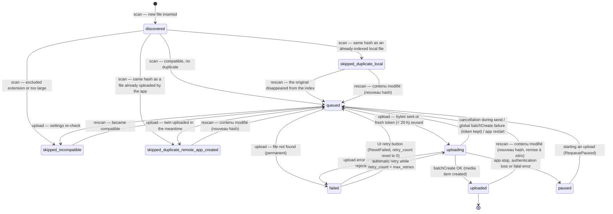

# SQLite database schema

> Technical document for developers. Reference sources:
> `src/MisterGPhotos.Core/Data/Migrations.cs`, `src/MisterGPhotos.Core/Data/Database.cs`,
> `src/MisterGPhotos.Core/Models/Enums.cs` and the repositories (`*Repository.cs`) in the `src/MisterGPhotos.Core/Data/` folder.

## Overview

All of the application's local data is stored in a single SQLite database:

- **File**: `%APPDATA%\MisterGPhotos\app.db` (the `AppPaths.DatabasePath` constant).
- **Access**: `Microsoft.Data.Sqlite`, without an ORM; SQL is hand-written in the repositories (`MediaFileRepository`, `SettingsRepository`, `AccountRepository`, `BatchRepository`, `LogRepository`).
- **Dates**: all dates are stored as `TEXT` in ISO 8601 UTC format (the "roundtrip" `"o"` format, e.g. `2026-07-11T14:32:05.1234567Z`) via `Database.ToDbDate` / `Database.FromDbDate`.
- **Sensitive content**: the database contains **no secrets**. The OAuth refresh token and the client secret are kept in the Windows Credential Manager (`CredentialStore`, `advapi32` CredWrite). Only the OAuth **client ID** (a non-secret value) is stored in the `settings` table.
- **Deletion**: the UI provides a button to fully delete the local data (`%APPDATA%\MisterGPhotos\`, database + logs). The application never deletes a scanned local file or a media item on Google Photos.

## Opening connections: WAL and busy_timeout

Every connection is opened by `Database.OpenConnection()`, which always runs:

```sql
PRAGMA journal_mode=WAL; PRAGMA busy_timeout=5000; PRAGMA foreign_keys=ON;
```

- **`journal_mode=WAL`** (Write-Ahead Logging): writes go through a separate journal (`app.db-wal`), which makes the database resilient to abrupt shutdowns (crash, power loss) and allows concurrent reads during writes.
- **`busy_timeout=5000`**: if the database is momentarily locked by another connection, SQLite retries for 5 seconds before returning an error. This is necessary because the scan, the upload, and the user interface each open their own short-lived connections.
- **`foreign_keys=ON`**: enables foreign key enforcement (disabled by default in SQLite), used by `upload_attempts`.

## Versioned migrations

The schema evolves through **ordered, idempotent migrations**, defined in `Migrations.All`
(a list of `(Version, Script)` pairs in `src/MisterGPhotos.Core/Data/Migrations.cs`) and applied
by `Database.Migrate()` on every construction of the `Database` object (that is, on every startup):

1. Creation of the `schema_version` table if it does not exist (`CREATE TABLE IF NOT EXISTS schema_version (version INTEGER NOT NULL)`).
2. Reading the current version: `SELECT COALESCE(MAX(version), 0) FROM schema_version`.
3. For each migration whose version is **strictly greater** than the current version:
   - the SQL script is executed **inside a transaction**;
   - the version is inserted into `schema_version` in the **same transaction**;
   - `COMMIT`. If it fails, the transaction is rolled back and the schema stays consistent.

The current schema version is **1** (a single creation script). To evolve the schema:
add a `(2, "ALTER TABLE ...")` entry to `Migrations.All` — never modify a script that has already been published.

## Tables

### `schema_version`

Tracks the migrations that have been applied.

| Column | Type | Role |
|---|---|---|
| `version` | `INTEGER NOT NULL` | Number of an applied migration. The current schema version is `MAX(version)`. |

### `settings`

Application settings as key/value pairs (the `AppSettings` class, `SettingsRepository` repository). Written with `INSERT ... ON CONFLICT(key) DO UPDATE`.

| Column | Type | Role |
|---|---|---|
| `key` | `TEXT PRIMARY KEY` | Name of the setting. |
| `value` | `TEXT` | Value, always serialized as text (invariant culture for numbers). |

Keys used and their bounds (the `AppSettings.Clamp()` method):

| Key | Default | Bounds | Role |
|---|---|---|---|
| `root_folder` | `""` | — | Root folder to scan. |
| `batch_size` | `20` | 1–50 | Files per batch. The bound of 50 is the hard limit of `mediaItems:batchCreate`. |
| `max_retries` | `5` | 0–20 | Maximum number of attempts for a file failing temporarily. |
| `concurrency` | `2` | 1–3 | Concurrent byte uploads. |
| `max_file_size_mb` | `200` | 1–200 | Maximum accepted size per photo (Google Photos limit: 200 MB). |
| `included_extensions` | `jpg,jpeg,png,webp,heic,heif,gif,tif,tiff,bmp,avif,ico,dng,cr2,cr3,crw,nef,nrw,arw,orf,raf,rw2,srw,pef,srf,sr2` | — | Included extensions, comma-separated, without a leading dot, in lowercase. |
| `oauth_client_id` | `""` | — | OAuth client ID created by the user in the Google Cloud Console (type "Desktop application"). Not secret: the client secret and the refresh token, by contrast, live in the Windows Credential Manager. |

### `google_account`

The connected Google account. A **single-row** table (`CHECK (id = 1)` constraint), `AccountRepository` repository. Disconnecting deletes the row (`DELETE ... WHERE id = 1`).

| Column | Type | Role |
|---|---|---|
| `id` | `INTEGER PRIMARY KEY CHECK (id = 1)` | Always `1`: at most one connected account. |
| `email` | `TEXT` | Email address of the Google account (obtained via the `email` scope). |
| `display_name` | `TEXT` | Display name of the account. |
| `connected_at` | `TEXT` | Date/time of connection (ISO 8601 UTC). |
| `scopes` | `TEXT` | Granted OAuth scopes (`photoslibrary.appendonly`, `photoslibrary.readonly.appcreateddata`, `openid`, `email`). |

### `media_files`

The heart of the application: the local inventory and the upload **state machine** (`MediaFileRepository` repository, `MediaFile` model). One row per image file discovered under the root folder.

| Column | Type | Role |
|---|---|---|
| `id` | `INTEGER PRIMARY KEY AUTOINCREMENT` | Internal identifier. |
| `local_path` | `TEXT NOT NULL UNIQUE` | Absolute path of the file. Uniqueness guarantees that a rescan never creates a duplicate in the database. |
| `file_name` | `TEXT NOT NULL` | File name (with extension). |
| `extension` | `TEXT NOT NULL` | Extension in lowercase, without a leading dot (e.g. `jpg`). |
| `file_size` | `INTEGER NOT NULL` | Size in bytes. |
| `sha256_hash` | `TEXT` | SHA-256 fingerprint of the content, in lowercase hexadecimal. `NULL` until the file has been hashed (e.g. an incompatible file). Used to detect duplicates and modifications. |
| `created_at` | `TEXT` | File creation date on disk (UTC). |
| `modified_at` | `TEXT` | Last modification date on disk (UTC). Together with `file_size`, this avoids re-hashing an unchanged file on rescan (2 s tolerance). |
| `scan_status` | `TEXT NOT NULL DEFAULT 'scanned'` | `scanned` or `missing` (see "Statuses" below). |
| `upload_status` | `TEXT NOT NULL DEFAULT 'discovered'` | Upload lifecycle state (see "Statuses" below). |
| `google_media_item_id` | `TEXT` | Identifier of the media item created in Google Photos after `batchCreate`. For a duplicate (`skipped_duplicate_remote_app_created`), it reuses the identifier of the already-uploaded twin. |
| `upload_token` | `TEXT` | Upload token returned by `POST /v1/uploads` (bytes already transmitted, media item not yet created). Cleared after `batchCreate` (whether the token is accepted or rejected). |
| `upload_token_at` | `TEXT` | Date the token was obtained. Google states a validity of roughly 24 h; the application only reuses it if it is **less than 20 h** old (`UploadService.UploadTokenLifetime`), otherwise the bytes are re-sent. |
| `retry_count` | `INTEGER NOT NULL DEFAULT 0` | Number of failed attempts. A `failed` file is retried as long as `retry_count < max_retries`; a permanent failure forces `retry_count` to the maximum so it is no longer retried. |
| `last_error` | `TEXT` | Last error message or reason for exclusion (incompatibility, duplicate). |
| `first_seen_at` | `TEXT NOT NULL` | First discovery by a scan (UTC). |
| `last_seen_at` | `TEXT NOT NULL` | Last time the file was seen by a scan. Used to detect files that have disappeared (`missing`). |
| `uploaded_at` | `TEXT` | Date the media item was successfully created in Google Photos. |

Indexes:

- `idx_media_files_upload_status` on `upload_status` — fast selection of the upload queue (`GetNextForUpload`) and of the per-status counters (`CountByStatus`).
- `idx_media_files_hash` on `sha256_hash` — duplicate lookup (`FindUploadedByHash`, `FindLocalDuplicate`).
- Implicit unique index created by the `UNIQUE` constraint on `local_path` — lookup by path on rescan (`GetByPath`).

### `upload_batches`

History of upload batches (`BatchRepository` repository, `UploadBatch` model). A batch = up to `batch_size` files: phase 1, obtaining the upload tokens (with limited concurrency); phase 2, a single `mediaItems:batchCreate` call.

| Column | Type | Role |
|---|---|---|
| `id` | `INTEGER PRIMARY KEY AUTOINCREMENT` | Batch identifier. |
| `created_at` | `TEXT NOT NULL` | Start of the batch (UTC). |
| `completed_at` | `TEXT` | End of the batch; `NULL` while it is in progress. |
| `file_count` | `INTEGER NOT NULL` | Number of files taken into the batch. |
| `success_count` | `INTEGER NOT NULL DEFAULT 0` | Files actually created in Google Photos. |
| `failure_count` | `INTEGER NOT NULL DEFAULT 0` | Files that failed in this batch. |
| `status` | `TEXT NOT NULL` | `running` (in progress), then `completed` (finished) or `stopped` (interrupted by a shutdown/cancellation). |

### `upload_attempts`

A trace of every upload attempt of a file (`BatchRepository` repository). Useful for diagnostics: you can see how many times a file was tried, when, and with what result.

| Column | Type | Role |
|---|---|---|
| `id` | `INTEGER PRIMARY KEY AUTOINCREMENT` | Attempt identifier. |
| `media_file_id` | `INTEGER NOT NULL REFERENCES media_files(id)` | The file concerned (foreign key, `foreign_keys=ON`). |
| `batch_id` | `INTEGER REFERENCES upload_batches(id)` | The batch in which the attempt took place (nullable). |
| `started_at` | `TEXT NOT NULL` | Start of the attempt (UTC). |
| `finished_at` | `TEXT` | End of the attempt; `NULL` if the application stopped mid-way. |
| `outcome` | `TEXT` | Result: `bytes_uploaded` (bytes sent, token obtained), `token_reused` (still-fresh token reused, bytes not re-sent), `skipped` (incompatible or duplicate), `failed`, `cancelled` (user cancellation). |
| `error` | `TEXT` | Error message or reason for the skip, where applicable. |

Index: `idx_upload_attempts_file` on `media_file_id` — attempt history of a file.

### `app_logs`

Persistent application log (`LogRepository` repository), complementing the text files `%APPDATA%\MisterGPhotos\logs\app-AAAAMMJJ.log`. Purgeable by age (`Purge(keepDays)`).

| Column | Type | Role |
|---|---|---|
| `id` | `INTEGER PRIMARY KEY AUTOINCREMENT` | Entry identifier. |
| `timestamp` | `TEXT NOT NULL` | Timestamp (ISO 8601 UTC). |
| `level` | `TEXT NOT NULL` | Level in lowercase: `debug`, `info`, `warning`, `error` (the `AppLogLevel` enum). |
| `source` | `TEXT` | Emitting component (e.g. `Scan`, `Upload`), nullable. |
| `message` | `TEXT NOT NULL` | Message. |

Index: `idx_app_logs_timestamp` on `timestamp` — chronological display and purge by date.

## Statuses

The text values stored in the database are defined by `StatusMapper` (`src/MisterGPhotos.Core/Models/Enums.cs`). Any unknown value throws an exception when read: the list below is exhaustive.

### `scan_status`

| Value | Meaning |
|---|---|
| `scanned` | The file was seen by the most recent scan of its root folder. |
| `missing` | The file was not seen again by the current scan (`MarkMissingUnderRoot`: `last_seen_at` earlier than the start of the scan, and `upload_status != 'uploaded'`), or it disappeared between the scan and the upload. A file found again during a later scan returns to `scanned`. |

### `upload_status`

| Value | Meaning |
|---|---|
| `discovered` | File discovered, not yet classified (the default state on insertion; transient during the scan). |
| `queued` | Queued for upload. |
| `uploading` | Upload in progress (bytes sent and/or awaiting `batchCreate`). |
| `uploaded` | Media item created in Google Photos (`google_media_item_id` and `uploaded_at` populated). Final state, unless the file content changes (new hash): it is then re-queued. |
| `skipped_duplicate_local` | Skipped: another **already-indexed** local file (with a smaller id) has the same SHA-256 hash. |
| `skipped_duplicate_remote_app_created` | Skipped: a file with the same hash has **already been uploaded by this application** (`google_media_item_id` copied from the twin). |
| `skipped_incompatible` | Skipped: extension not included, or size above the limit (`max_file_size_mb`). Can become `queued` again if the settings change and a rescan makes it compatible. |
| `failed` | Failed. Retried automatically as long as `retry_count < max_retries` (default 5); a permanent failure (e.g. file not found, non-transient API error) forces `retry_count` to the maximum. The UI's retry button (`ResetFailed`) resets `retry_count` to 0 and the status to `queued`. |
| `paused` | Upload cleanly interrupted (application shutdown, user stop, loss of authentication, fatal service error); resumed automatically on the next upload run. |

**Limitation to be aware of (changes to the Google Photos Library API on March 31, 2025)**: the API no longer allows reading the user's entire library; an application can only read the media items it created itself. There is therefore **no status** corresponding to "duplicate of a photo already present in Google Photos but uploaded some other way". The text shown in the UI is accurate: "Google Photos does not allow this application to check your entire library. Duplicate detection is guaranteed only for files already indexed locally or uploaded by this application."

### `upload_status` transition diagram

Transitions verified in `FileScanner.ProcessFile`, `UploadService` (`PrepareUploadTokenAsync`, `BatchCreateAsync`, `RunAsync`) and `MediaFileRepository` (`RequeueInterrupted`, `MarkUploadingAsPaused`, `RequeuePaused`, `ResetFailed`).



Recovery points guaranteed by persisting every transition:

- **On application startup**: `RecoverAfterRestart()` resets `uploading` → `queued`. The `upload_token` is **kept**: if it is less than 20 h old, the bytes are not re-sent (the `token_reused` attempt outcome).
- **On shutdown or fatal error**: `MarkUploadingAsPaused()` resets `uploading` → `paused`.
- **Network circuit breaker**: after 5 consecutive transient failures (`ConsecutiveTransientLimit`), the service stops and switches the in-progress files to `paused`; the delays between retries follow an exponential backoff capped at 60 s with jitter, and the `Retry-After` header is honored.
